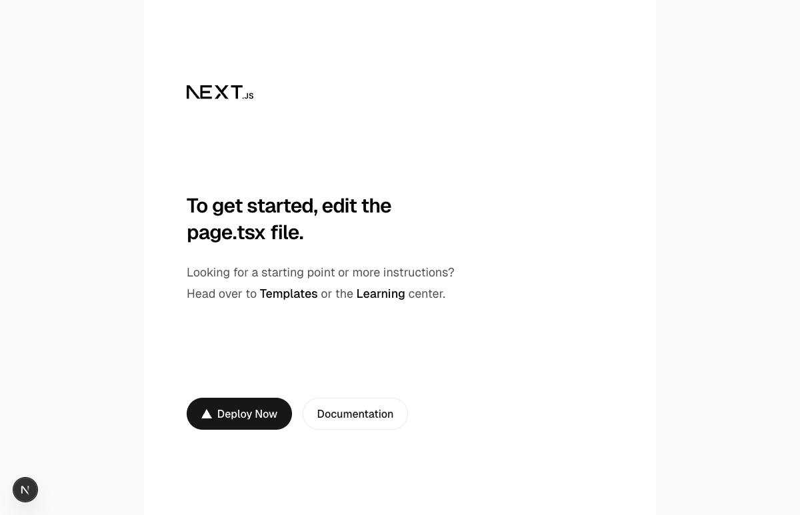
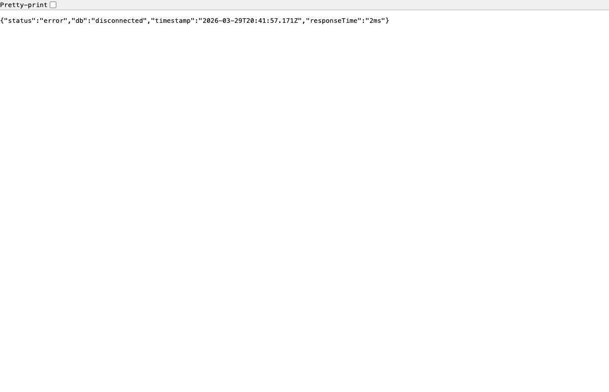
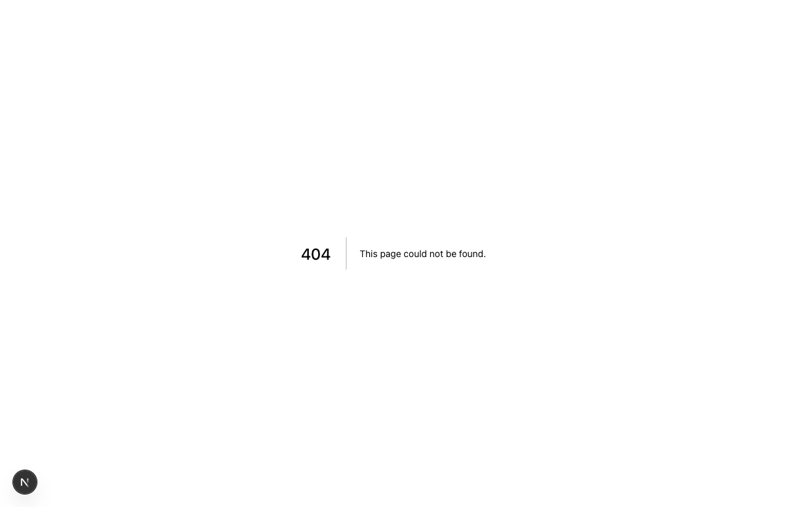

# Playwright MCP — Workflow Demonstration

## Overview

This document records a complete workflow using the Playwright MCP server integration with Claude Code. The demo navigates the running DevPrint application, interacts with UI elements, tests API endpoints, and verifies route handling — all from within a Claude Code conversation.

## Prerequisites

- Dev server running (`npm run dev` on `localhost:3000`)
- Playwright MCP server connected (see [MCP_SETUP.md](MCP_SETUP.md))

## Workflow: Navigate DevPrint and Verify App State

### Step 1 — Navigate to Homepage

**Tool used:** `browser_navigate`

Navigated to `http://localhost:3000`. The page loaded successfully with the Next.js starter template, confirming the dev server is running and the app renders without errors.

**Observations:**
- Page title: "Create Next App"
- Renders Next.js logo, heading, Templates/Learning links, Deploy Now and Documentation buttons
- No console errors



### Step 2 — Screenshot the Homepage

**Tool used:** `browser_take_screenshot`

Captured a full viewport screenshot of the homepage for visual verification. This confirms the Tailwind CSS styling is applied correctly and the layout renders as expected.

### Step 3 — Test the Health API Endpoint

**Tool used:** `browser_navigate`

Navigated to `http://localhost:3000/api/health` to verify the API layer is functional.

**Response:**
```json
{"status":"error","db":"disconnected","timestamp":"2026-03-29T20:41:57.171Z","responseTime":"2ms"}
```

The API route works correctly. The `db: "disconnected"` status is expected in local development without Supabase credentials configured. The endpoint responds in 2ms.



### Step 4 — Click a Navigation Link

**Tool used:** `browser_click`

Navigated back to the homepage and clicked the "Documentation" link (ref `e13`). The link correctly opened Next.js docs in a new browser tab, confirming:
- Link elements are clickable and interactive
- `target="_blank"` behavior works as expected
- No JavaScript errors on interaction

### Step 5 — Verify 404 Handling for Unbuilt Routes

**Tool used:** `browser_navigate`

Navigated to `http://localhost:3000/technologies` — a route that doesn't exist yet in the app (planned for Sprint 2).

**Result:** Next.js returned a proper 404 page with "This page could not be found." This confirms the framework's default error handling is in place.



### Step 6 — Close Browser

**Tool used:** `browser_close`

Closed the Playwright browser session to clean up resources.

## Tools Used in This Demo

| Tool | Purpose | Count |
|------|---------|-------|
| `browser_navigate` | Navigate to URLs | 4 |
| `browser_take_screenshot` | Capture visual evidence | 3 |
| `browser_click` | Interact with page elements | 1 |
| `browser_snapshot` | Read page accessibility tree | (used implicitly with navigate) |
| `browser_close` | Clean up browser session | 1 |

## Value Demonstrated

The Playwright MCP integration enables Claude Code to:

1. **Visually verify** that the app renders correctly without leaving the conversation
2. **Test API endpoints** by navigating to them and reading the response
3. **Interact with UI** — click buttons, follow links, fill forms
4. **Catch issues early** — 404s, console errors, and broken layouts are visible immediately
5. **Generate evidence** — screenshots serve as documentation and proof of testing

This complements the existing test infrastructure:
- **Vitest** handles unit/component tests in CI
- **Playwright test runner** (`npm run test:e2e`) handles scripted E2E tests
- **Playwright MCP** enables interactive, exploratory testing during development
